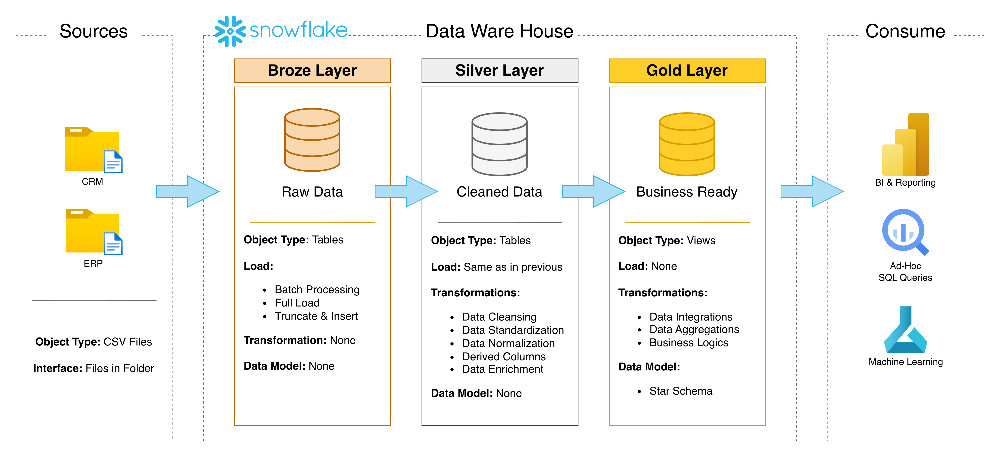
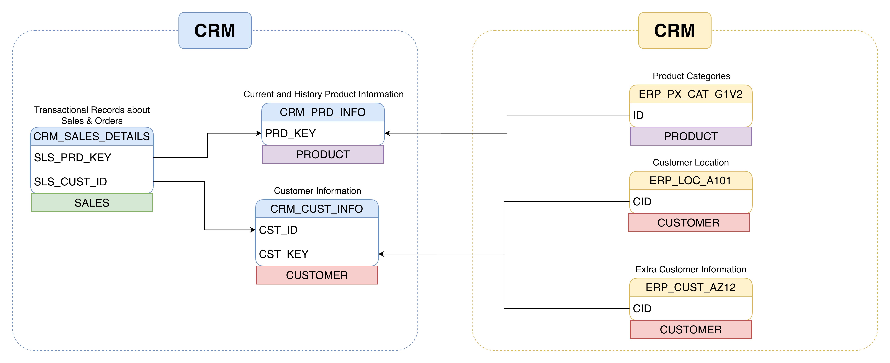
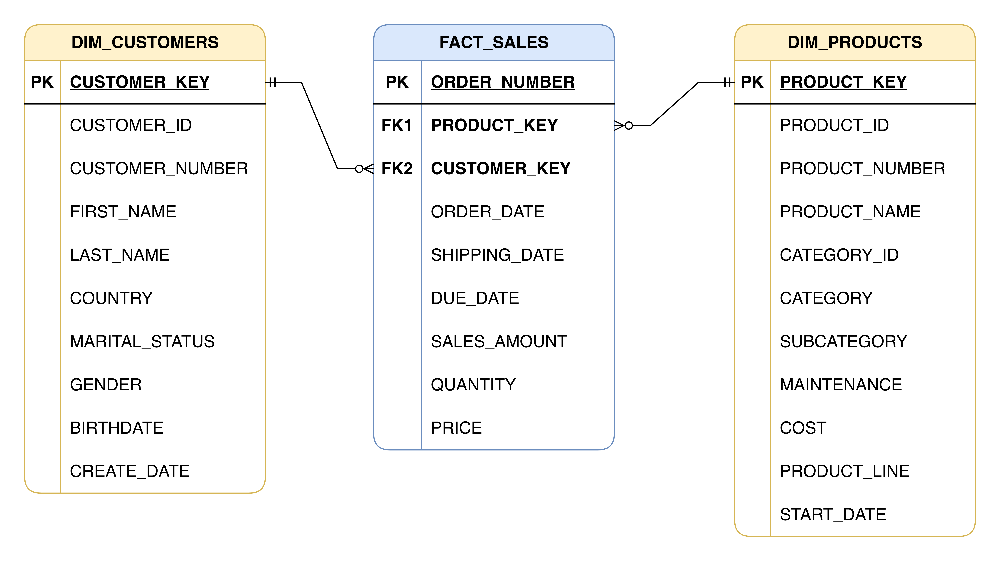
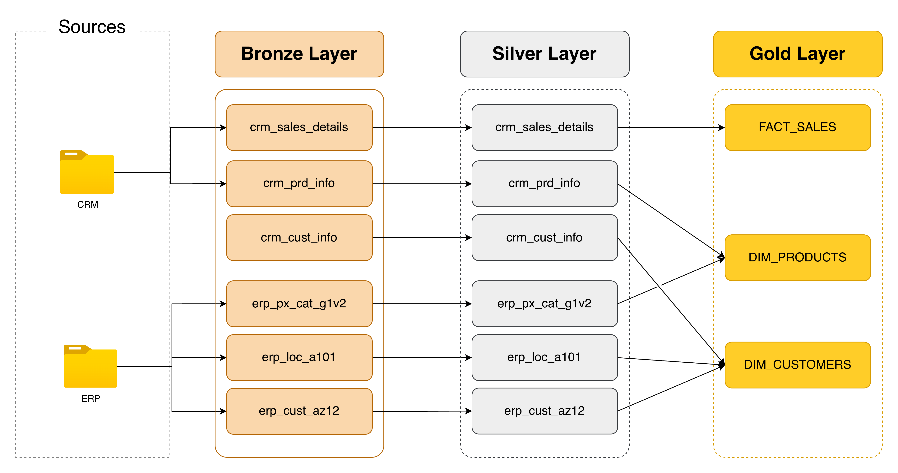

# ❄️ Snowflake Medallion Data Warehouse

[](https://www.snowflake.com/)
[](https://en.wikipedia.org/wiki/SQL)
[](https://aws.amazon.com/s3/)

---

## 📖 Overview

This project implements a robust **Medallion Architecture** within **Snowflake**, transforming raw data into high-value business insights. By utilizing a three-tier logical structure—**Bronze**, **Silver**, and **Gold**—we ensure data integrity, traceability, and optimized performance for high-level analytics and business intelligence.

The architecture leverages **Snowflake's** cloud-native SQL engine and **AWS S3** for seamless data ingestion and transformation.

---

## 🏗️ Architecture

The pipeline follows the classic Medallion pattern, incrementally refining data as it moves through the warehouse.



### 🔵 Bronze Layer (Raw Ingestion)

- **Role**: Landing zone for exactly-as-is source data.
- **Source**: Parquet/CSV files ingested from **AWS S3** via Storage Integrations.
- **Process**: Automated metadata extraction and minimal transformation to preserve lineage.

### ⚪ Silver Layer (Refined & Validated)

- **Role**: The "Single Source of Truth."
- **Process**: Data type casting, null handling, deduplication, and standardization.
- **Quality**: Applies business rules to ensure consistency across all entities.

### 🟡 Gold Layer (Curated & Analytical)

- **Role**: Business-ready Star Schema (Dimensions & Facts).
- **Structure**: Optimized for reporting tools (Power BI, Tableau).
- **Process**: Complex joins and business logic to produce actionable datasets.

---

## 🗺️ Data Modeling

The project illustrates the transition from normalized source systems to an optimized analytical model.

### 📍 Source ERD

The source systems (CRM and ERP) represent a normalized relational structure where data is distributed across multiple functional entities.



### 📍 Data Warehouse Model (Gold Layer)

The final Gold layer is modeled as a **Star Schema**, consisting of centralized Fact tables and descriptive Dimension tables, optimized for high-performance analytical querying.



---

## 📊 Data Flow & Modeling

The project transforms scattered source data into an elegant Star Schema.

### Data Model Evolution



### Core Entities

| Entity            | Description                                                   |
| :---------------- | :------------------------------------------------------------ |
| **Dim Customers** | Enriched customer profiles with CRM and ERP data integration. |
| **Dim Products**  | Product catalog with historical tracking and categorization.  |
| **Fact Sales**    | Centralized sales transactions linking all dimensions.        |

---

## 📂 Project Structure

```text
snowflake-sql-medallion-warehouse/
├── _docs/                  # 📄 Architecture diagrams & Data Catalog
├── data/                   # 💾 Sample source datasets (CSV)
├── scripts/                # 📜 Logic & DDL
│   ├── bronze/             #   └─ Ingestion SPs & Table DDLs
│   ├── silver/             #   └─ Cleaning Logic & Orchestration
│   └── gold/               #   └─ Analytical Views & Fact/Dim Logic
├── utils/                  # 🛠️ Infrastructure setup (AWS/DB Init)
└── tests/                  # 🧪 Data validation scripts
```

---

## 🚀 Getting Started

### 1. Infrastructure Setup

Run the initialization scripts in the `utils/` directory to provision your Snowflake environment and AWS connectivity.

```sql
-- Initialize Database & Schemas
@utils/init_database.sql

-- Setup AWS S3 Integration
@utils/init_aws.sql
```

### 2. Deploy Medallion Pipeline

Execute the layers in sequence using the provided SQL scripts:

```bash
# 1. Bronze Layer
snow sql -f scripts/bronze/ddl_bronze.sql
snow sql -f scripts/bronze/sp_load_bronze.sql

# 2. Silver Layer
snow sql -f scripts/silver/ddl_silver.sql
snow sql -f scripts/silver/sp_load_silver.sql

# 3. Gold Layer
snow sql -f scripts/gold/ddl_gold.sql
snow sql -f scripts/gold/sp_load_gold.sql
```

### 3. Orchestration & Automation

The project uses **Snowflake Tasks** for automated execution:

- **Silver Task**: Runs every 5 minutes (`scripts/silver/orchestrate_silver.sql`).
- **Gold Task**: Daily update or manual trigger (`scripts/gold/orchestrate_gold.sql`).

---

## 📑 Data Catalog (Gold Layer)

A detailed look at the curated analytical tables:

### **`GOLD.DIM_CUSTOMERS`**

| Column         | Type   | Context                 |
| :------------- | :----- | :---------------------- |
| `CUSTOMER_KEY` | INT    | Unique surrogate key.   |
| `CUSTOMER_ID`  | INT    | Business ID.            |
| `COUNTRY`      | STRING | Geographic location.    |
| `GENDER`       | STRING | Unified across CRM/ERP. |

### **`GOLD.FACT_SALES`**

| Column         | Type   | Context                 |
| :------------- | :----- | :---------------------- |
| `ORDER_NUMBER` | STRING | Transaction identifier. |
| `SALES_AMOUNT` | INT    | Total monetary value.   |
| `QUANTITY`     | INT    | Unit count.             |

---

## ✨ Design Principles

- **Snake Case**: All objects follow `table_name_convention`.
- **DWH Metadata**: Technical columns prefixed with `dwh_` (e.g., `dwh_create_date`).
- **Surrogate Keys**: Dimension keys use the `_key` suffix for optimized joining.

---

## 🤝 Let's Connect

Stay in touch or report an issue:

[](https://wa.me/923074315952)
[](https://www.linkedin.com/in/asadali27232/)
[](https://github.com/asadali27232)
[](mailto:asadali27232@gmail.com)
